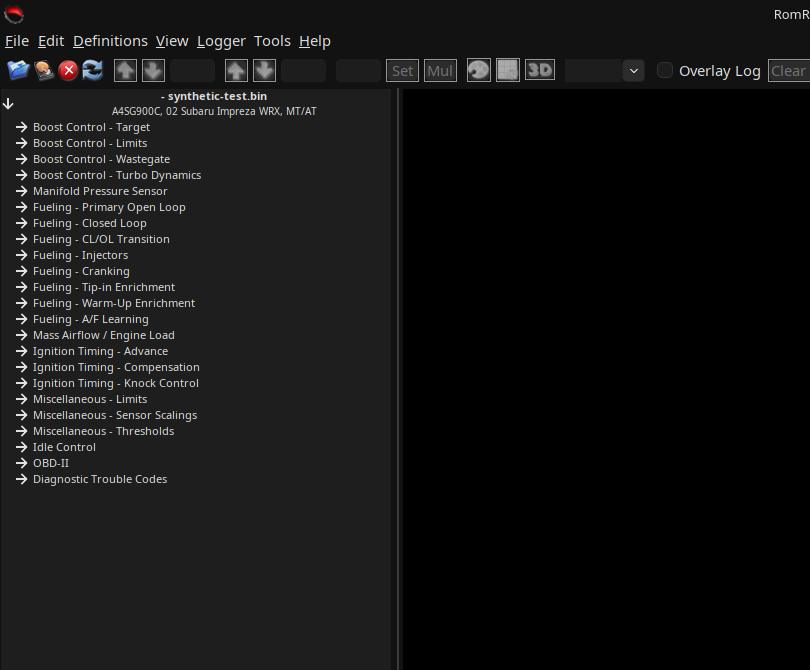
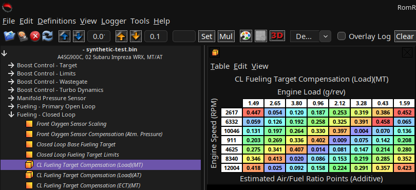
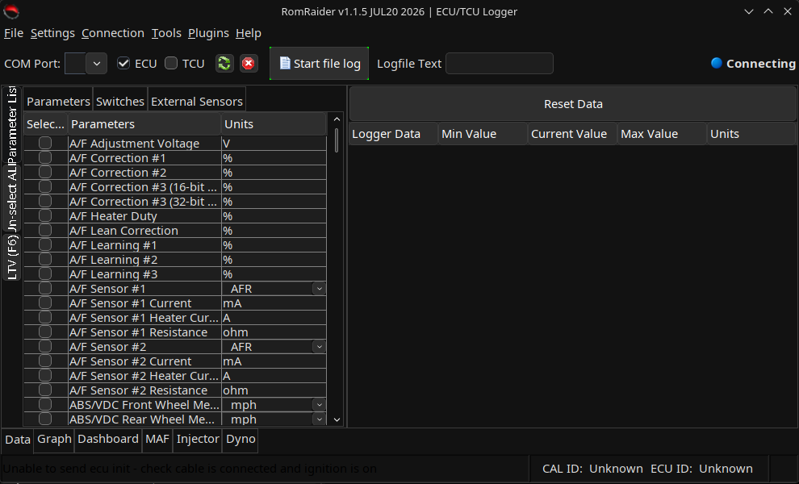

# RomRaider

> **Note:** This is a fork of [RomRaider/RomRaider](https://github.com/RomRaider/RomRaider)
> that adds native Linux packaging. If you're on Windows, get the official
> builds from the upstream repo linked above instead.

RomRaider is a free, open source tuning suite created for viewing, logging and
tuning of modern Subaru Engine Control Units. The intuitive tuning interface
and powerful datalogger are modelled to be familiar to experienced professional
tuners while providing all the power of expensive commercial products, without
license fees.

See Building_RomRaider.txt for information on generating usable binaries.

## Screenshots

| ECU Editor                                                                                          | Tuning table                                                                                                        |
| --------------------------------------------------------------------------------------------------- | ------------------------------------------------------------------------------------------------------------------- |
|  |  |

| RomRaider Logger                                                                                  |
| ------------------------------------------------------------------------------------------------- |
|  |

All three screenshots are from this fork's native Linux build (Fedora/KDE,
Nimbus look and feel with native window decorations).

## Linux packaging

This fork adds native Linux packaging on top of upstream RomRaider: `.rpm`
(Fedora/RHEL), `.deb` (Debian/Ubuntu), and a Flatpak bundle. Releases are
published automatically on the [Releases page](../../releases) whenever a
`v*` tag is pushed. For Windows builds, use the upstream
[RomRaider/RomRaider](https://github.com/RomRaider/RomRaider) repo.

### Usage

Install whichever package matches your distro (from the
[Releases page](../../releases)):

```sh
# Fedora/RHEL
sudo dnf install ./romraider-*.rpm

# Debian/Ubuntu
sudo apt install ./romraider-*.deb

# Any distro, via Flatpak
flatpak install --user romraider-*.flatpak
```

Two launchers are installed, and both also show up in your desktop
environment's application menu (search for "RomRaider"):

```sh
RomRaider         # ECU Editor - view/tune a ROM image
RomRaiderLogger   # Datalogger - connect to a running ECU over serial/USB
```

On first launch, the Editor will prompt you to configure an ECU definition
file, and the Logger will prompt for a logger definition file — see
[Definition auto-loading](#definition-auto-loading) below to skip that
prompt entirely. Typical workflow in the Editor:

1. `File > Open Image...` and select a `.bin`/`.hex` ROM dump.
2. Expand a category in the definition tree on the left (e.g. `Fueling`,
   `Ignition Timing`, `Boost Control`) and press Enter/double-click a table
   to open it.
3. Tables are color-coded (a red/green/blue heatmap) so outlying values
   stand out at a glance; edit cells directly or use the toolbar's
   increment/decrement/interpolate tools.
4. `File > Save Image...` writes your changes back out to a `.bin`.

In the Logger, tick the checkboxes next to the parameters you want to
monitor, choose the correct `COM Port`, then `Start file log` to begin
logging to disk while connected to a vehicle.

### Definition auto-loading

Rather than reconfiguring ECU/logger definitions on every fresh install,
both launchers auto-load definition files if found in a well-known
per-user folder:

```
~/.RomRaider/definitions/ecu_defs.xml   # used by the ECU Editor
~/.RomRaider/definitions/logger.xml     # used by the Logger
```

If a file is present there _and_ no definition is already configured in
your settings, it's loaded automatically and silently — no dialog, no
manual setup. Definitions for your vehicle can be obtained from
[RomRaider/SubaruDefs](https://github.com/RomRaider/SubaruDefs).

**To override this** (use a different definition than the auto-loaded
one, or switch vehicles), you don't need to touch the files in
`~/.RomRaider/definitions/` — just point the app at a different file
through its normal UI, which takes precedence from then on:

- Editor: `Definitions > Definition Manager...`
- Logger: `Settings > Logger Definition Location...`

Auto-loading only ever fires when _nothing_ is configured yet, so once
you've picked a definition (whether via auto-load or manually), that
choice sticks across restarts. To go back to relying on auto-load, clear
the configured file from the settings dialogs above, or delete
`~/.RomRaider/settings.xml` to reset all settings.

### Known limitation: Innovate LM2 via MTS Link

The Innovate LM2 external logger plugin (`Lm2MtsDataSource`) talks to
Innovate's MTS Link software through `com4j`, a Java-to-COM bridge — COM is
a Windows-only technology, so **this specific plugin does not work on
Linux**, on any of the Linux packages above. It fails gracefully (logged as
an error, doesn't crash the app) and every other external logger plugin
(AEM, PLX, 14Point7, Phidgets, Zeitronix, TechEdge, etc.) is unaffected,
since those use serial/USB rather than Windows COM.

See the following links for further information:

- http://www.romraider.com/
- http://www.romraider.com/forum/
- https://github.com/RomRaider/RomRaider
